

<!-- _class: lead -->

# A Stochastic Model Predictive Control Algorithm For Energy Arbitrage On the Day-Ahead Market Under Operational Constraints

### Alban Puech and Gorazd Dimitrov

 

---
<!-- _class: lead -->

# Introduction

---

# Context 
## Increased dependence on variable energy sources 

- According to IEA, solar + wind = 70 percent of electricity production by 2050 in Europe [IEA]
- Need for solutions to increase grid reliability and flexibility
- Battery storage systems (BSS) can help in handling sudden and large changes in the power supply or demand

---
## Peak Shaving via Energy arbitrage

- Peak shaving = eliminate short-term demand spikes, smooth out peak loads
- Can be done via Energy Arbitrage using BSS [2]
- Buy and store when electricity prices are low (low demand), discharge and sell when prices are high (high demand)

---

## Benefits of Peak Shaving

- Profitability of energy arbitrage depends on the intraday volatility of electricity prices
- Represents an additional revenue stream for asset owners
- Increases ROI of batteries 
- Increases the return to renewable production and reduces CO2 emissions [3]

---

## Day-Ahead Market specificities 

- Hourly prices for the next day are determined through an auction process that closes before midday
- Buying and selling orders are binding and need to be placed before market closure
- Prices are unknown before market closure
- Need to plan in advance the buying and selling orders = **need for a charging schedule**
- Unknown prices = **Stochastic optimization problem**

---

## Problem

For everyday $d$, we generate $S_d$, the schedule for the day $d$ before market closure on day $d-1$. We denote by $\Delta E_d(h)$ the change in energy stored in the battery at hour $h$ on day $d$.

 $$S_d = (\Delta E_d(0), \Delta E_d(1), \dots, \Delta E_d(23))$$

---
## Sample charge schedule

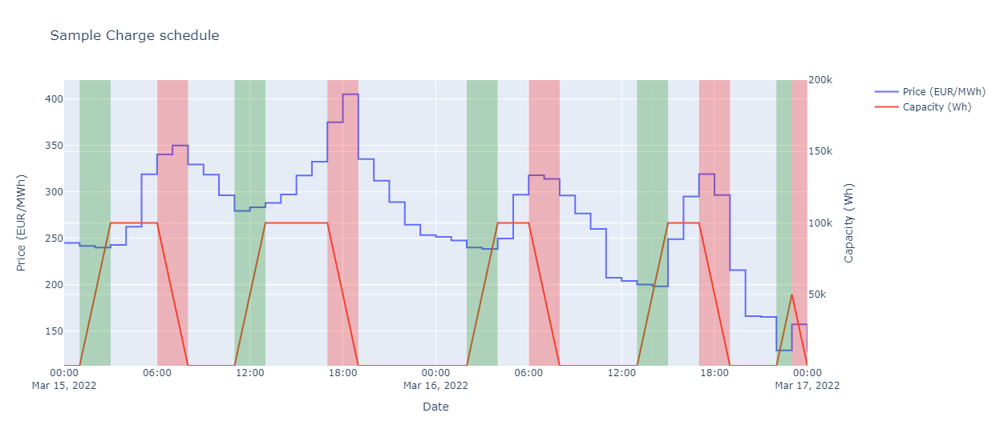
<figcaption style="font-size:0.8em">Sample schedule for a 100 kWh battery, assuming no grid cost, a constant charge rate of 0.5C, and without
any limit on the number of charging/discharging cycles.</figcaption>

---

# Related Work 

Many linear programming approached [4,5,6,7,8], but :
- Battery models are often too simple (no variable charging rates, no battery degradation)
- Sometimes no real-world data and no clear baseline
- Generally assume known prices or use artificial forecasts (true prices with some gaussian noise)

---

# Contributions 

- A **battery model** with variable charging rates, discharge efficiency decrease, and capacity fading
- A **stochastic MPC solution** to the profit maximization task that can be deployed using Linear Programming solvers
- A **Python library** to output daily optimal schedules for custom data using built-in price forecasting and that allows running simulations on historical prices
- A **quantitative comparison** of the performances of our predictive optimization model with a baseline that outputs the optimal schedules, for different key hyperparameters and different European countries.
- A **discussion** of the impact of capacity fading, discharge efficiency decrease, and the charging rates on the profit obtained via arbitrage

---
<!-- _class: lead -->

# Methodology

--- 
<!-- ## Decision variables :

We optimize the energy change in the battery for each hour of the day $d$ so as to maximize profit. Our decision variable is $S_d$ :

 $$S_d = (\Delta E_d(0), \Delta E_d(1), \dots, \Delta E_d(23))$$

--- -->

## Price prediction   

We use the mean hourly prices over the last $l$ days as a prediction for $p_d(h)$, the day-ahead electricity price at hour $h$ on day $d$ :
$$
 \begin{equation*}
     \~{p_d}(h) = \sum_{d' = d-l}^{d-1} \frac{p_d(h)}{l}
 \end{equation*}
$$

---

## Battery model

- Battery of initial energy capacity $Q_{0}$
- Battery has a state of charge $SOC$:

$$
\begin{align*}
    SOC(h) = \begin{cases} \frac{E_{init} + \sum_{t = 0}^{h-1} \Delta E(t)}{Q} \text{ if } h \in \{1,2,..,24\}\\
    \frac{E_{init}}{Q} \text{ if } h=0
    \end{cases}
\end{align*}
$$

where $E_{init}$ denotes the initial energy stored in the battery at hour $0$:

---

## Charging rate 

During charge/discharge, the state of charge $SOC$ varies as a function of the charging rate $r(t)$, expressed in W/Wh, which varies during the charge:

$$
\begin{equation*}
    SOC(h) = \text{Clip}_{[0,1]}\big(SOC(0) + \int_{t=0}^{h} r(t)dt\big)
\end{equation*} 
$$

The (dis)charging curves give the rates as a function of the SOC

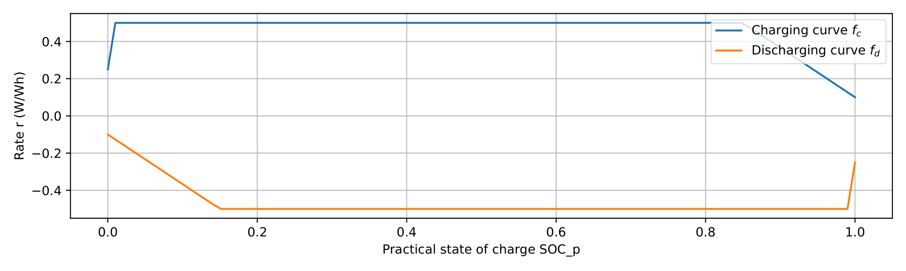

---

We can derive the maximum (positive) hourly energy change $\Delta E_{max}(SOC(h))$ and the maximum (negative) hourly energy change $\Delta E_{min}(SOC(h))$ between hour $h$ and hour $h+1$. 
$$
\begin{align*}
    \Delta E_{max}(SOC(h)) = \text{min}\bigg(1-SOC(h), \int_{t=h}^{t=h+1} f_c(SOC(t)) dt \bigg) \times Q\\
    \Delta E_{min}(SOC(h)) = \text{max}\bigg(-SOC(h), \int_{t=h}^{t=h+1} f_d(SOC(t)) dt\bigg) \times Q
\end{align*}
$$

---

The constraint on the energy change between hour $h$ and hour $h+1$ then writes as :

$$
\begin{align*}
   \Delta E_{max}(SOC(h)) \leq \Delta E(h) \leq  \Delta E_{min}(SOC(h))
\end{align*}
$$

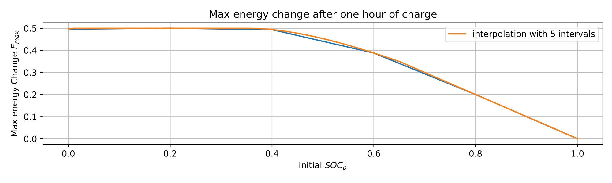
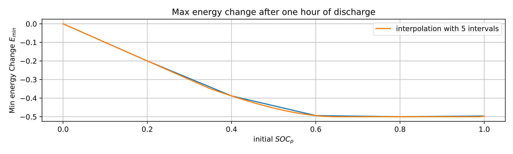

---
## Availability constraints

- Energy Arbitrage = Additional revenue stream for asset owners using their batteries for another main purpose (e.g. backup energy source)

- Need to make sure that the battery is charged enough at some key point, or on the contrary discharged enough to store energy excess from renewables :

$$
\begin{equation*}
   SOC_{min}(h) \leq SOC(h) \leq SOC_{max}(h) \quad \forall h \in \{1,2,\dots,24\} 
\end{equation*}
$$

---

## Capacity fading

- Battery loses capacity with time and the number of charge/ discharge cycles.
- We assume a linear decrease of the capacity from $Q_{0}$ to $Q_{min}$ reached after $Cycle_{max}$ cycles.

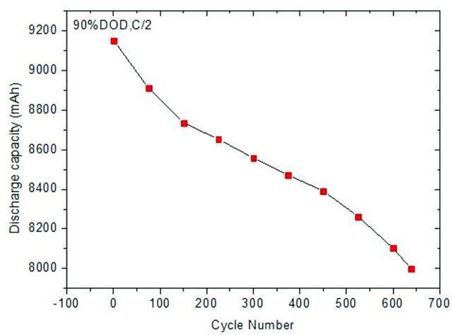
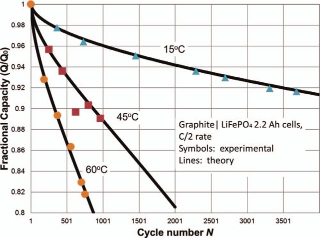
<figcaption style="font-size:0.8em">Left: Capacity fading of a LiFePO4. [9]. Right: Capacity fading of the cell as a function of number of cycles for different temperatures. [10]</figcaption>

---

The capacity at day $d$, denoted by $Q(d)$, is computed as:
$$
\begin{align*}
&Q(d) = \text{max}(Q_{min}, Q_{0} - \alpha \times n_{cycles}(d))\\
&n_{cycles}(0) = 0 \\
&n_{cycles}(d) = \frac{\sum_{d' = 0}^{d-1} \Delta E_{day}(d')}{2 Q(d)}, d \geq 1\\
&Q_{min} = 0.8 \times Q_{0} \\
&\alpha = \frac{Q_{0}-Q_{min}}{Q_{min}} 
\end{align*}
$$

Where $\Delta E_{day}(d)$ denotes the total amount of energy exchanged during day $d$

---

The charge efficiency $\eta$ decreases with the number of cycles. We update it similarly to the capacity:

$$
\begin{align*}
&\eta(d) = \text{max}(\eta_{min}, \eta_0 - \beta \times n_{cycles}(d)   ) \\
&\eta_{min} = 0.8 \times \eta_0 \\
&\beta = \frac{\eta_0-\eta_{min}}{\eta_{min}} 
\end{align*}
$$

--- 

## Grid costs 

- Variable grid costs $\mathrm{vgc}(h)$ [EUR/MWh] : to be multiplied by the total amount of energy exchanged with the grid

- Fixed grid costs $\mathrm{fgc}(h)$ [EUR] : paid for every hour when energy has been exchanged with the grid

---

## Profit from energy arbitrage

We optimize profits from arbitrage using forecasted prices

If the battery is charging at hour $h$, the forecasted (negative) profit $\pi(h)$ is the forecasted cost of the electricity bought added to the variable and fixed grid costs. 

$$
\begin{equation*}
    \pi(h) = -(~{p}(h) + \mathrm{vgc}(h))\times \Delta E(h) + \mathrm{fgc}(h) 
\end{equation*}
$$

If the battery is discharging at hour $h$, the forecasted profit $\pi(h)$ is the revenue from the electricity sold taking into account the discharge efficiency $\eta(d)$, net of the variable and grid costs.

$$
\begin{equation*}
    \pi(h) = -(~{p}(h) + \mathrm{vgc}(h))\times \eta \times \Delta E(h) + \mathrm{fgc}(h) 
\end{equation*}
$$

---

The objective function then writes as :

$$
\begin{align*}
    \pi_{total} &= - \sum_{h=0}^{23} \pi(h)\\
    \pi(h) &= 
    \begin{cases} - \Delta E(h) \times (~{p}_d(h) + \mathrm{vgc}(h)) +  \mathrm{fgc}(h) \text{ if } \Delta E(h) > 0 \\ 
    \eta \Delta E(h) \times (~{p}_d(h) + \mathrm{vgc}(h)) +  \mathrm{fgc}(h) \text{ if } \Delta E(h) < 0
    \end{cases}
\end{align*}
$$

---
<!-- _class: lead -->

# Stochastic MPC formulation

---

## We define a stochastic MPC task solved using LP :

- **Decision variable** : $S_d = (\Delta E_d(0), \Delta E_d(1), \dots, \Delta E_d(23))$

- **Main parameters** : functions : $\Delta E_{max}, \Delta E_{min}, f_c, f_d$

- **Call-specific parameters** (specific to day $d$): $Q_d, \eta_d$

- **Exogenous stochastic parameters** :  $p_d(h)$, approximated by $\~{p_d}(h), \quad h \in \{1,...,24 \}$
- **State Variable** : $SOC_d(h),\quad h \in \{1,...,24 \}$

---

<!-- _class: recap -->

# Stochastic MPC formulation
$$
\begin{align*}

    \underset{\tiny{\Delta E(0),\Delta E(1), ..., \Delta E(23)}}{\text{minimize}} &: 
    \quad \pi_{total} = - \sum_{h=0}^{23} \pi(h)\\
    &\pi(h) = 
    \begin{cases} - \Delta E(h) \times (~{p}_d(h) + \mathrm{vgc}(h)) +  \mathrm{fgc}(h) \text{ if } \Delta E(h) > 0 \qquad \\ 
    \eta \Delta E(h) \times (~{p}_d(h) + \mathrm{vgc}(h)) +  \mathrm{fgc}(h) \text{ if } \Delta E(h) < 0
    \end{cases}
    \\
    \text{subject to} &: \\
    \tiny{\text{SOC definition}} &\begin{cases}  
    SOC(h) = \frac{E_{init} + \sum_{t = 0}^{h-1} \Delta E(t)}{Q}, \quad h \in \{1,...,24 \}\\
    SOC(0) = \frac{E_{init}}{Q} 
    \end{cases} \\
    \tiny{\text{SOC bounds}} &\begin{cases}  SOC(h) \in [0,1], \quad h \in \{0,...,24 \} \end{cases}  \\
    \tiny{\text{Availability constraint}} &\begin{cases}  
     SOC_{min}(h) \leq SOC(h) \leq SOC_{max}(h) \quad \forall h \in \{1,2,\dots,24\} \end{cases}  \\
    \tiny{\text{Max (dis)charging rates}} &\begin{cases}  \Delta E_{max}(SOC(h)) \leq \Delta E(h) \leq  \Delta E_{min}(SOC(h)), \quad h \in \{1,...,24 \} \end{cases}  \\

\end{align*}
$$

---

# Linear approximation of $\pi$

 we introduce the boolean variables $c(h)$, $d(h)$ that respectively indicate if the battery is charging at hour $h$, and if the battery is discharging at hour $h$. 

 $$
\begin{align*}
&\pi_{total} = \sum_{h=0}^{23} \big[\Delta E(h) \times (c(h) + d(h)\times \eta) \times (\~{p}_d(h) + \mathrm{vgc}(h)) +(c(h)+d(h)) \times \mathrm{fgc}(h) \big] \\
& \varepsilon - M \times (1-c(h) \leq \Delta E(h) \leq eps + M \times c(h) \quad \forall h \in \{0,2,\dots,23\} \\
& \varepsilon - M \times (1-d(h) \leq - \Delta E(h) \leq eps + M \times d(h) \quad \forall h \in \{0,2,\dots,23\} \\
&c \in \{0,1\} \\
&d \in \{0,1\} \\
\end{align*}
$$

---
<!-- _class: recap_smaller -->

# Linear approximation of $\Delta E_{min}$ and $\Delta E_{max}$

We discretize the interval $[0,1]$ into $N_{int}$ intervals of length $N_{int}^{-1}$. This adds the following set of constraints to our LP model:

$$
\begin{align*}
{\text{set weight values}}\biggl\{&\sum_{k=1}^{N_{int}} \lambda[k,h] \frac{k-1}{N_{int}} + \mu[k,h]\frac{k}{N_{int}} = SOC(h), \quad \forall h \in \{0,2,\dots,23\}  \\
{\text{select interval}}\biggl\{&\lambda[k,h] + \mu[k,h] = y[k,h], \quad \forall h \in \{0,2,\dots,23\}, \quad \forall k \in \{1,2,\dots,N_{int}\} \\
{\text{ensure one interval is selected}}\biggl\{&\sum_{k=1}^{N_{int}} y[k,h] = 1, \quad \forall h \in \{0,2,\dots,23\}  \\
{\text{set max SOC change}}\biggl\{&\sum_{k=1}^{N_{int}} \lambda[k,h] \Delta E_{max}(\frac{k-1}{N_{int}}) + \mu[k,h] \Delta E_{max}(\frac{k}{N_{int}}) \geq \Delta E(h), \quad \forall h \in \{0,2,\dots,23\} \\
{\text{set min SOC change}}\biggl\{&\sum_{k=1}^{N_{int}} \lambda[k,h] \Delta E_{min}(\frac{k-1}{N_{int}}) + \mu[k,h] \Delta E_{min}(\frac{k}{N_{int}}) \leq \Delta E(h), \quad \forall h \in \{0,2,\dots,23\} \\
(\mu[k,h],\lambda[k,h],y[k,h]) &\in [0,1] \times [0,1] \times \{0,1\}, \quad \forall h \in \{0,2,\dots,23\}, \quad \forall k \in \{1,2,\dots,N_{int}\} \\
\end{align*}
$$
 
---

## Implementation

- AmplPy for AMPL call from python code
- Gurobi solver

---

<!-- _class: lead -->

# Results

--- 

## Experiment setup

### Battery

- 1 MWh capacity battery ($Q_0 = 10^6$)
- Charging  / Discharging curves as shown previously (0.5 W/Wh peak rate)
- Initial discharge efficiency $\eta=0.99$
- Cycle life $Cycles_{max}=4000$

---

### Prices
- Constant variable grid costs of 5 EUR/MWh $\mathrm{vgc}_d(h) = 5 \times 10^{-6} \quad \forall h \in \{0,2,\dots,23\}, \forall d$.

- Simulation ran on the **German** day-ahead wholesale electricity prices between **January 30th, 2022** and **December 31st, 2022**.

---

### Other considerations 

- We end the day with a fully discharged battery: $SOC_{{max}_d}(24) = 0 \quad \forall d$
- Daily schedule starts at 00:00 and ends at 24:00

--- 

## Algorithm Comparison

- **LP-PRED** : 
  - The algorithm we defined up until now
  - Uses price prediction 
  - optimal schedule w.r.t predicted prices

- **LP-OPTIM (Baseline)** : 
  - Uses true prices 
  - Gives optimal schedules
  - No stochasticity involved

---

| Algorithm | l | Daily profit | Relative diff in profit with LP-OPTIM | #cycles | #Days neg. profit | MAE price pred. |
|---|---|---|---|---|---|---|
| LP-PRED | 42 | 220.56 | -19\% | 645 | 2 | 0.782 |
| LP-PRED | 35 | 221.06 | -19\% | 643 | 1 | 0.753 |
| LP-PRED | 28 | 222.07 | -19\% | 643 | 2 | 0.730 |
| LP-PRED | 14 | 222.03 | -19\% | 643 | 1 | 0.627 |
| LP-PRED | 7 | 220.17 | -19\% | 650 | 2 | 0.555 |
| LP-PRED | 2 | 201.91 | -26\% | 682 | 3 | 0.534 |
| LP-PRED | 1 | 188.14 | -31\% | 717 | 5 | 0.506 |
| LP-OPTIM | . | 273.31 | . | 718 | 0 | . |

Each simulation took ~2 minutes (Gurobi solver, AMD Ryzen 5 4600Hz, 16.0 GB RAM). 

---

## Importance of $l$ (window size for price prediction)

- Highest profits achieved for large $l$
- larger $l$ decreases the number of cycles => the algorithm better tracks electricity price spreads when the forecast is based on a longer historical period
- small $l$ lead to overfitting: The schedule is based on variations observed in the last $l$ days, but that do not accurately describe the usual intraday price variations
- MAE does not accurately describe the quality of the price prediction for the scheduling task

--- 

## Profit distribution 

- Two main drivers :
  - Intraday spreads
  - Absolute prices

---

<figcaption>LP-PRED (top) / LP-OPTIM (bottom). Germany January 31st, 2022 - December 31st.</figcaption> 
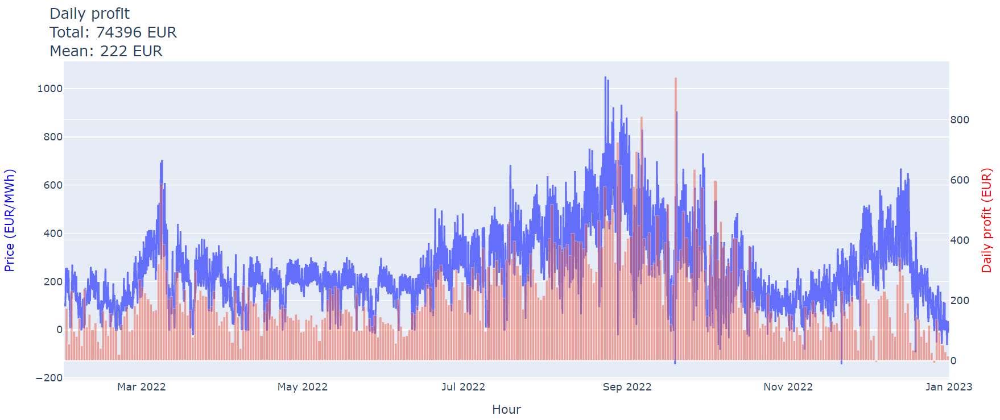
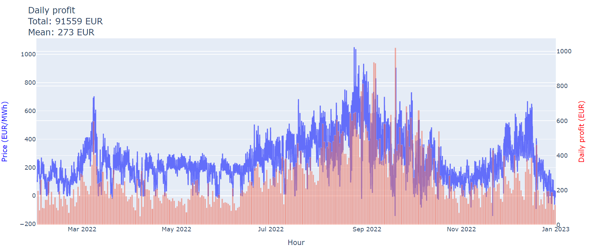

---

## Relative profit difference between LP-OPTIM and LP-PRED 

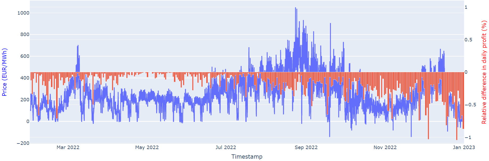

---

## Results in other European countries 

| Algorithm | Country | l | Avg. Daily Profit | Relative diff in profit with LP-OPTIM | MAE prediction |
|:---:|:---:|:---:|:---:|:---:|:---:|
| LP-PRED | Germany | 30 | 222.07 | -19\% | 0.730 |
| LP-PRED | France | 30 | 167.36 | -17\% | 0.688 |
| LP-PRED | Denmark | 30 | 185.90 | -11\% | 0.762 |
| LP-PRED | Spain | 30 | 94.01 | -13\% | 0.277 |
| LP-PRED | Italy | 30 | 94.01 | -11\% | 0.580 |

---

<figcaption style="font-size:0.8em">France January 31st 2022 - December 31st.</figcaption>
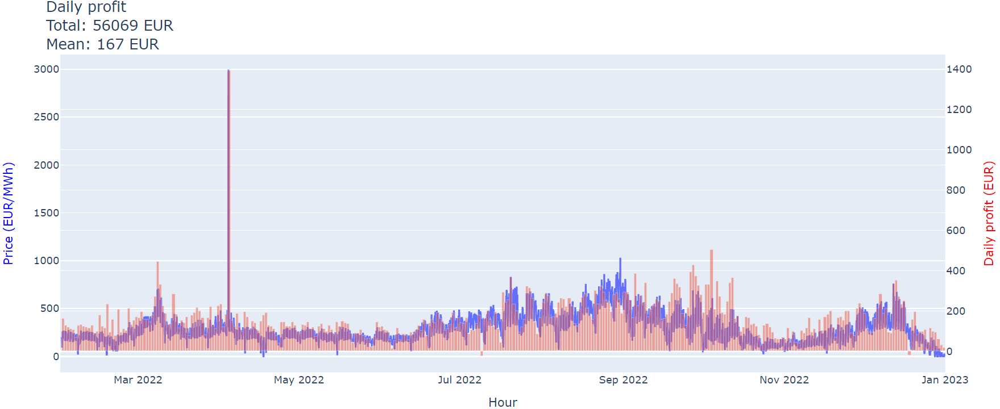
<figcaption style="font-size:0.8em">LP-PRED</figcaption>
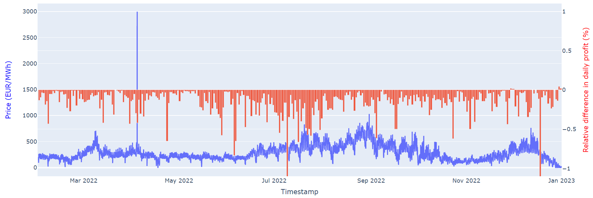
<figcaption style="font-size:0.8em">Rel. Difference in profit with LP-OPTIM</figcaption>

---

<figcaption style="font-size:0.8em">Denmark January 31st 2022 - December 31st.</figcaption>
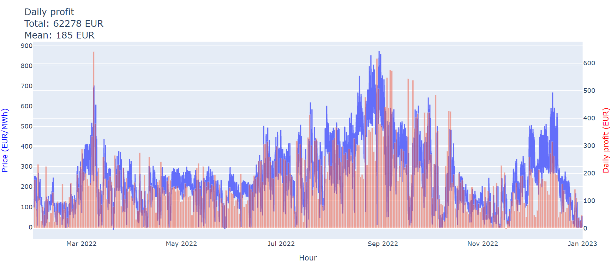
<figcaption style="font-size:0.8em">LP-PRED</figcaption>
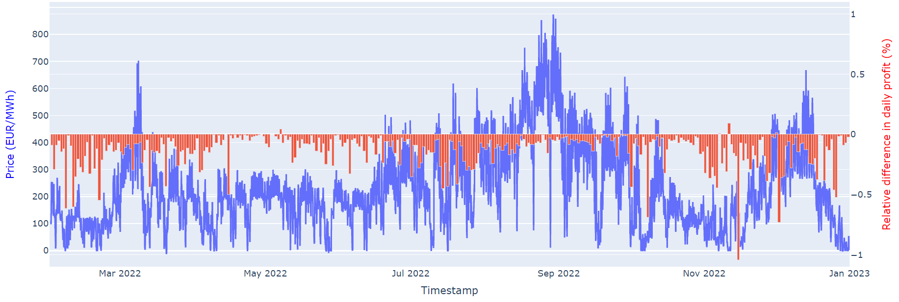
<figcaption style="font-size:0.8em">Rel. Difference in profit with LP-OPTIM</figcaption>

---

<!-- _class: recap_smaller -->

## Impact of the charging/ discharging rate 

<figcaption>Relative difference in profit between a 1 W/Wh and a 0.5 W/Wh peak rate battery</figcaption>
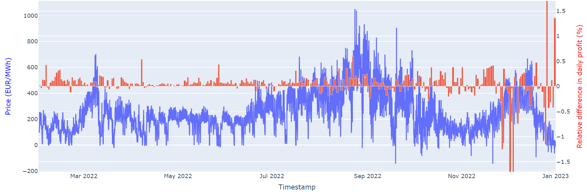
<figcaption>LP-PRED</figcaption>
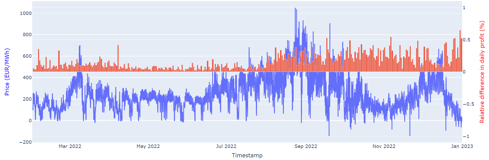
<figcaption>LP-OPTIM</figcaption>

- Higher charging rate generally increases profits (more electricity can be traded)
- Also increases the loss when the electricity is traded at the wrong times (because of wrong price predictions)

---

## Impact of battery degradation (capacity fading + efficiency decrease)

<figcaption>Relative profit loss due to battery degradation with LP-OPTIM</figcaption>
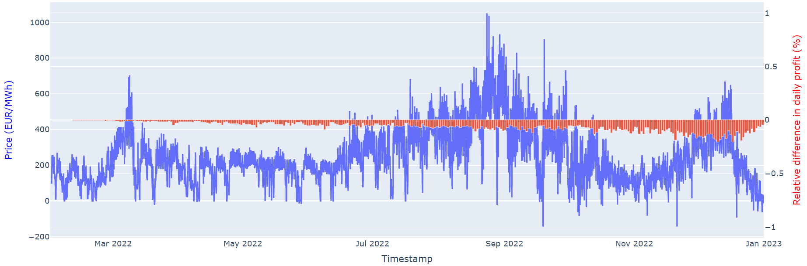

---

<!-- _class: lead -->

# Conclusion

---

## Conclusion

- We proposed a **Stochastic MPC algorithm** for energy arbitrage profit maximization

- Introduced a **battery model** with capacity fading, efficiency decrease, variable charging rates

- Achieved between **80 percent (Germany) and 89 percent (Denmark) of the maximum obtainable profit** on an **11-month-long simulation on the 2022 electricity prices**

- Reported a **daily profit of 222 euros** for a 1MWh battery with 0.5 peak charging and discharging rate in Germany

---

## Future Work

- The difference with the maximum relative profit can be further decreased by **improving the price forecasting**
  - Rely on **machine learning** regression model or stat models (e.g. ARIMA)
  - **Define a loss function** that describes the quality of the prediction for the optimization task (we are not interested in the absolute price value, but in knowing the intraday hourly price variations)

---

<!-- _class: references -->

# References :

[1] Iea. Net zero by 2050 – analysis, May 2021
[2] Claudia Pavarini. Battery storage is (almost) ready to play the flexibility game – analysis, Nov 2018.
[3] Omer Karaduman. Economics of grid-scale energy storage. Job market paper, 2020.
[4] Dheepak Krishnamurthy, Canan Uckun, Zhi Zhou, Prakash R. Thimmapuram, and Audun Botterud. Energy storage arbitrage under day-ahead and real-time price uncertainty. IEEE Transactions on Power Systems, 33:84–93,2018.
[5] Md Umar Hashmi, Arpan Mukhopadhyay, Ana Bušic, and Jocelyne Elias. Optimal control of storage under time varying electricity prices. In 2017 IEEE International Conference on Smart Grid Communications
(SmartGridComm), pages 134–140, 2017.
[6] Peter M. van de Ven, Nidhi Hegde, Laurent Massoulié, and Theodoros Salonidis. Optimal control of end-user
energy storage. IEEE Transactions on Smart Grid, 4(2):789–797, 2013.
[7] Yixing Xu and Chanan Singh. Adequacy and economy analysis of distribution systems integrated with electric energy storage and renewable energy resources. IEEE Transactions on Power Systems, 27(4):2332–2341, 2012.
[8] Alessandro Di Giorgio, Francesco Liberati, Andrea Lanna, Antonio Pietrabissa, and Francesco Delli Priscoli. Model predictive control of energy storage systems for power tracking and shaving in distribution grids. IEEE Transactions on Sustainable Energy, 8(2):496–504, 2017
[9] Zhang, Heng & Liu, Weiwei & Dong, Yazhou & Zhang, Hong-Chao & Chen, Hao. (2014). A Method for Pre-determining the Optimal Remanufacturing Point of Lithium ion Batteries. Procedia CIRP. 15. 218–222. 10.1016/j.procir.2014.06.064. 
[10] Deshpande, Rutooj & Verbrugge, Mark & Cheng, Yang-Tse & Wang, John & Liu, Ping. (2012). Battery Cycle Life Prediction with Coupled Chemical Degradation and Fatigue Mechanics. Journal of the Electrochemical Society. 159. A1730-A1738. 10.1149/2.049210jes. 

